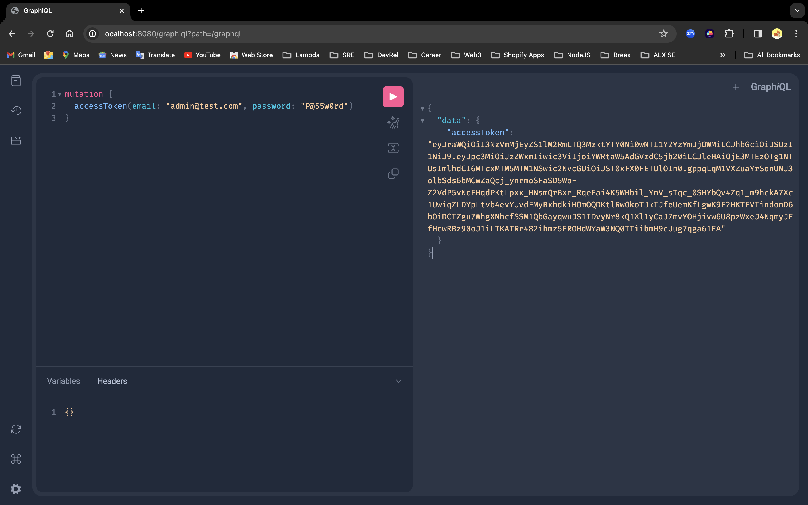
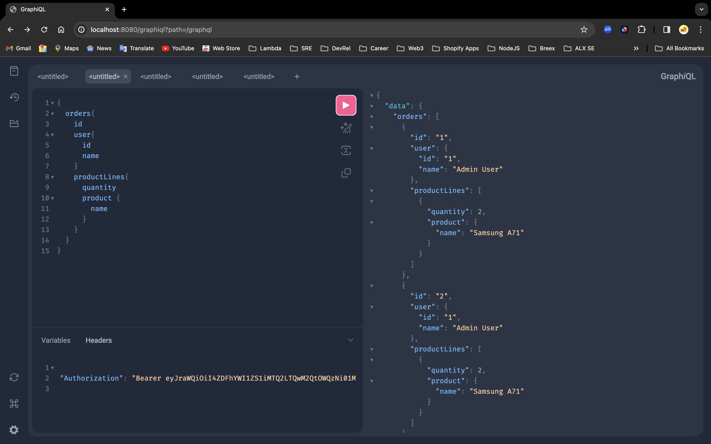

# Stockify: Simplifying Inventory Management

Stockify is a robust Java Spring Boot application designed to streamline user, product, and order management. It incorporates advanced authentication and authorization mechanisms, a versatile GraphQL API, and intelligent business logic to handle low stock items effectively. Developed following the principles of Domain-Driven Design (DDD), Stockify ensures a well-structured and organized codebase.

## Developer
- **Name:** Mike Attara

## Key Features

### Data Models
- **User:** Represents a user with attributes such as `id`, `name`, `email`, `password`, and `role` (defined as an enum: `USER` or `ADMIN`). Note: Passwords are securely stored and cannot be queried for security reasons.
- **Product:** Represents a product with attributes like `id`, `name`, `stock`, and `price`.
- **Order:** Represents an order with attributes including `id`, `products` (a list of `ProductLine`), and `user` (a reference to a `User`).
- **ProductLine:** Represents a line item in an order with details like `productId`, `quantity`, and `orderId`.

### Authentication and Authorization
- Implemented robust authentication using Spring Security.
- API endpoints are secured to allow only authenticated users to perform actions, with the exception of the login route.
- Authorization mechanisms are in place to restrict access to specific resources based on user roles.




### GraphQL API
- Implemented a GraphQL API featuring queries and mutations for managing users, products, and orders.
  - Queries include:
    - Retrieving all users.
    - Fetching a specific user by ID.
    - Listing all products.
    - Getting details of a specific product by ID.
    - Accessing all orders (users will see only their orders).
    - Retrieving a specific order by its ID.
    - Finding all orders associated with a specific user.
    - Fetching all products for a given order.
    - Identifying products below a certain stock threshold (default threshold is 1).
  - Mutations include:
    - Creating a new user (admin/user).
    - Updating user details.
    - Deleting a user.
    - Adding a new product.
    - Updating product information.
    - Removing a product.
    - Placing a new order.
    - Updating an existing order.

### Additional Features
- Incorporated intelligent business logic to handle and manage items with low stock efficiently.

## Technical Insights

### Development Approach
- Adhered to Domain-Driven Design (DDD) principles for a well-organized codebase.
- Employed a structured approach with layers including `application`, `domain`, `infrastructure`, and `interfaces` to maintain separation of concerns.
- Maven was utilized for efficient dependency management.

### Docker Setup
- Established a Docker image to simplify the deployment process.

## Setting Up and Running the Application

### Prerequisites
- JDK (Java Development Kit) installed on your machine (Version 17 is recommended).
- Docker installed on your machine.

### Steps

1. Clone the repository:
   ```bash
   git clone https://github.com/attaradev/MikeAttara-javaproject.git
   ```

2. Navigate to the project directory:
   ```bash
   cd MikeAttara-javaproject
   ```

3. Build the Docker image:
   ```bash
   docker build -t stockify-app .
   ```

4. Run the Docker container:
   ```bash
   docker run -p 8080:8080 stockify-app
   ```

5. Access the application at `http://localhost:8080`.

## Default Users for Testing
- Upon deployment, the system automatically creates two users: an admin and a normal user, facilitating easy testing.
  - Admin Email: admin@test.com
  - User Email: user@test.com
  - Password for both: P@55w0rd

## Running Tests

Stockify comes with a suite of tests to ensure robustness and reliability. Follow these steps to run the tests:

### Prerequisites
- Maven installed on your machine.
- Docker installed on your machine (optional, if you prefer running tests within a container).

### Steps

1. Navigate to the project directory:
   ```bash
   cd MikeAttara-javaproject
   ```

2. Run the tests using Maven:
   ```bash
   mvn test
   ```

   This command will execute all the tests in the project.

3. After running the tests, review the output to ensure all tests pass successfully.

If you encounter any issues or have questions regarding testing, feel free to contact me at [mike@attara.dev](mailto:mike@attara.dev).
