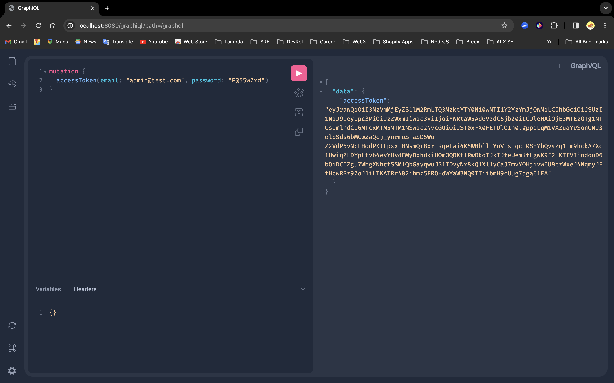

# Stockify

Stockify is a Java Spring Boot application that provides a comprehensive solution for managing users, products, and orders. It includes authentication and authorization mechanisms, a GraphQL API, and business logic to manage low stock items. The development approach followed Domain-Driven Design (DDD) principles to organize and structure the codebase.

## Developer
- **Name:** Mike Attara

## Features

### Data Models
- **User:** Represents a user with attributes `id`, `name`, `email`, `password`, and `role` (an enum of `USER` and `ADMIN`). NB: Cannot query for password for security.
- **Product:** Represents a product with attributes `id`, `name`, `stock`, and `price`.
- **Order:** Represents an order with attributes `id`, `products` (a list of `ProductLine`), and `user` (a `User`).
- **ProductLine:** Represents a line item in an order with attributes `productId`, `quantity`, and `orderId`.

### Authentication and Authorization
- Implemented authentication using Spring Security.
- Secured the API endpoints to allow only authenticated users to perform certain actions.
- Implemented authorization to restrict access to specific resources based on user roles or permissions.



### GraphQL API
- Implemented a GraphQL API with queries and mutations for users, products, and orders.
  - Queries:
    - Get all users.
    - Get a specific user by ID.
    - Get all products.
    - Get a specific product by ID.
    - Get all orders.
    - Get a specific order by ID.
    - Get all orders for a specific user.
    - Get all products for a specific order.
    - Get all products below a given threshold (default threshold is 1);
  - Mutations:
    - Create a new user (admin/user).
    - Update a user.
    - Delete a user.
    - Create a new product.
    - Update a product.
    - Delete a product.
    - Create a new order.
    - Update an order.
    - Delete an order.

### Other Features
- Implemented business logic to identify and manage items with low stock.

## Technical Details

### Development Approach
- Followed Domain-Driven Design (DDD) principles to structure the codebase.
- Organized code into `application`, `domain`, `infrastructure` and `interfaces` layers to maintain separation of concerns.
- Utilized Maven for dependency management.

### Docker Setup
- Created a Docker image to facilitate easy deployment of the application.

## Setup and Running the Application

### Prerequisites
- JDK (Java Development Kit) installed on your machine
- Docker installed on your machine

### Steps

1. Clone the repository:
   ```bash
   git clone https://github.com/attaradev/MikeAttara-javaproject.git
   ```

2. Navigate to the project directory:
   ```bash
   cd MikeAttara-javaproject
   ```

3. Build the Docker image:
   ```bash
   docker build -t stockify-app .
   ```

4. Run the Docker container:
   ```bash
   docker run -p 8080:8080 stockify-app
   ```

5. Access the application at `http://localhost:8080`.

## Contact
For any inquiries or support regarding this project, please contact Mike Attara at [mike@attara.dev](mailto:mike@attara.dev).
```